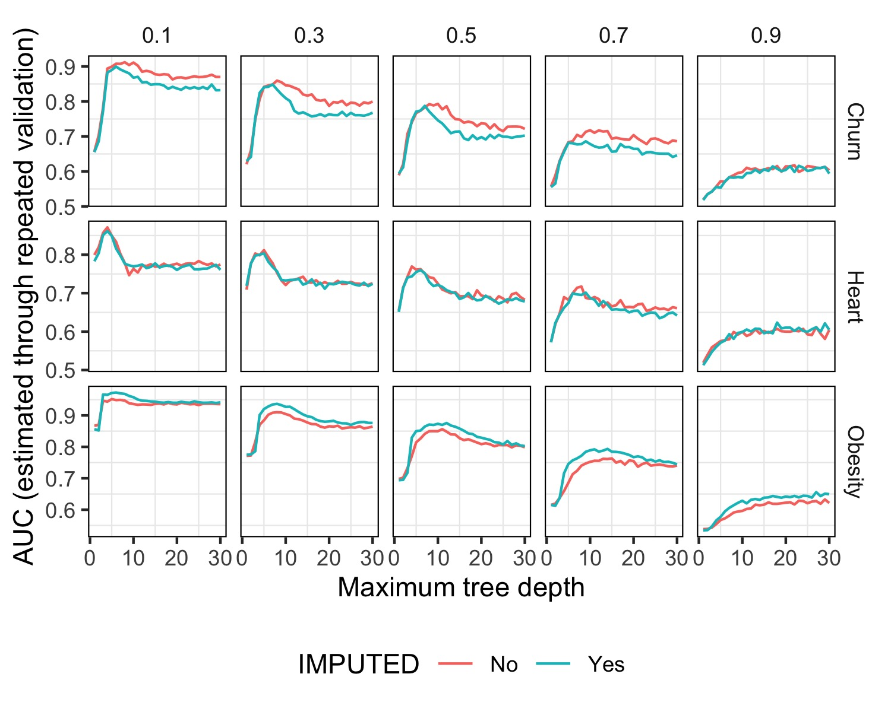

# Ejercicio 2

\-\-\-\-\-\-\-\-\-\-\-\-\-\-\-\-\-\-\-\-\-\-\-\-\--

## Experimento 1

#### Hipotesis:

En este experimento, exploramos cómo la presencia de valores faltantes en los conjuntos de datos afecta la calidad y el rendimiento de los modelos predictivos. Creemos que a medida que aumenta el porcentaje de valores faltantes en el conjunto de datos, la calidad y el rendimiento del modelo se verán negativamente afectados, llevando a una disminucion en la capacidad predictiva de aquel. Esto se da por porque la falta de datos puede introducir un sesgo en el modelo y por ende llevar a tomar decisiones menos informadas.

Por otro lado, creemos que el uso de imputacion de valores faltantes puede tener un efecto positivo en el rendimiento del modelo en comparacion con tener valores no imputados. Esto se da porque se le permite al modelo utilizar informacion generada razonable, antes que desechar filas con valores faltantes.

#### Graficos:

```{r}
source("./provided_functions.R")


```

#### Observaciones:

Durante el experimento, observamos las siguientes tendencias:

-   Correlación entre valores imputados y mejor rendimiento del modelo: Cuando los valores imputados generan un mejor modelo que los no imputados, esta tendencia se mantiene constante a medida que aumenta la cantidad de valores faltantes, y viceversa.

-   Mantenimiento de la distribución y forma: La distribución y forma de cada modelo se mantienen similares a lo largo del experimento, aunque su rendimiento empeora progresivamente. La tendencia de la distribución se mantiene constante, incluso mientras el rendimiento disminuye.

-   Empeoramiento con valores faltantes: A medida que aumenta la cantidad de valores faltantes en los conjuntos de datos, el rendimiento de los modelos empeora de manera notable.

-   Impacto positivo y negativo de la imputación: Se observa que imputar los valores faltantes es beneficioso para el conjunto de datos de "Obesity", mientras que para el conjunto de datos de "Churn" el efecto es opuesto. En el caso de "Heart", el rendimiento del modelo es similar con o sin imputación.

#### Conclusiones:

Los resultados obtenidos en este experimento respaldan nuestras predicciones iniciales. A medida que la cantidad de valores faltantes aumenta, se observa una degradación en el rendimiento del modelo en todos los escenarios. Esto subraya la importancia de considerar la cantidad de valores faltantes al construir modelos predictivos.

A su vez podemos concluir que si bien imputar valores faltantes puede ser beneficioso en algunos casos, como se ve en el conjunto de datos "obesity", no es una estrategia universalmente eficaz. En el caso del conjunto de datos "churn", no siempre resulta en un mejor rendimiento. Este comportamiento puede deberse a que el método de imputación empleado no es preciso o adecuado para los datos, introduciendo ruido en lugar de información útil. En última instancia, no existe una regla universal sobre si se debe imputar o no valores faltantes, y esto debe evaluarse caso por caso.
