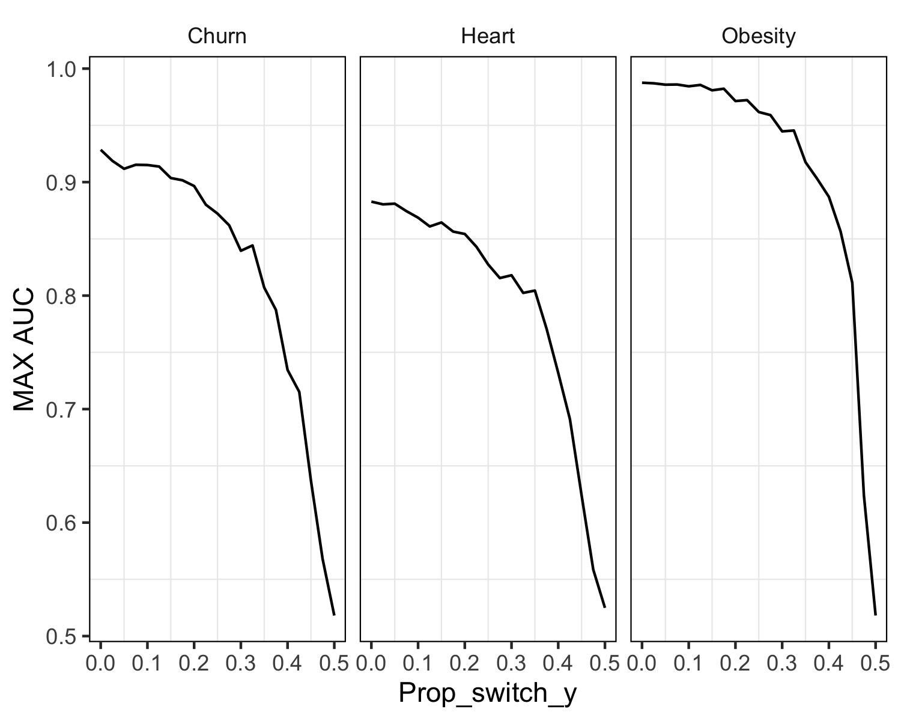

```{r include=FALSE}
source("exp_4.R")

```

En este último experimento, buscamos investigar el impacto del ruido presente en las variables que deseamos predecir en el rendimiento de los árboles de decisión en diferentes conjuntos de datos y niveles de ruido. Este experimento es muy esencial, ya que el ruido es una característica común en muchos escenarios de modelado, lo que nos daría un entendimiento más profundo de cómo se comportan los modelos en situaciones como estas. Nuestro objetivo es obtener una perspectiva más completa sobre cómo el ruido puede afectar la capacidad predictiva de los árboles de decisión en contextos muy comunes en la práctica.

Nuestra hipótesis plantea que a medida que aumenta el nivel de ruido en las variables objetivo, la precisión del rendimiento de los árboles de decisión disminuirán. Esperamos ver que el aumento del ruido introducirá mayor variabilidad en las predicciones, lo que resultará en una disminución de las métricas de evaluación del modelo, como el área bajo la curva (AUC).

```{r echo=FALSE}
#grafico

```

```{r echo=FALSE}
library(tidyr)

# Read the data from the "exp_4_table.txt" file
table_data <- read.table("./outputs/tables/exp_4_table.txt", header=TRUE, sep="\t")

# Reshape the data to have prop_switch_y values as columns
table_data_wide <- table_data %>%
  pivot_wider(names_from = prop_switch_y, values_from = max_mean_auc)

# Print the wide-format table data
print(table_data_wide)
```

En la ejecución del experimento, calculamos los valores máximos de la métrica AUC para cada uno de los conjuntos de datos: Churn, Heart y Obesity, variando los porcentajes de ruido en las variables objetivo.

Nuestros resultados confirmaron nuestras expectativas. A medida que incrementamos el porcentaje de ruido, observamos una tendencia clara de disminución en la métrica AUC en los tres datasets. Esta tendencia se da porque la presencia de ruido indica una mayor proporción de valores en la variable objetivo que se intercambian entre 0 y 1.

Solo se evaluo el maximo AUC hasta donde la probabilidad de intecambiar los valores era del 50%, es decir, un 0.5 de ruido en los datasets. En el conjunto de datos Churn, iniciamos con un máximo AUC de 0,93, pero a partir del 25% de ruido, este valor decreció por debajo de 0,9, llegando finalmente a un nivel de desempeño de 0,52. De manera similar, en el conjunto de datos Heart, el máximo AUC inicial de 0,89 se redujo rápidamente hasta alcanzar un valor mínimo de 0,51 con mayores niveles de ruido. Respecto al dataset Obesity, el modelo comenzó con un máximo AUC de 0,99 en condiciones de ausencia de ruido (0%), y a partir del 25% de ruido, disminuyó poco a un valor de 0,97. En todos los casos, tienen probabilidad de ser intercambiados del 0,5, el maximo AUC se encuentra en 0,5 aproximadamente.

Estos hallazgos resaltan la influencia negativa del ruido en las variables objetivo sobre la capacidad predictiva de los modelos de árboles de decisión, validando nuestra hipótesis inicial.
