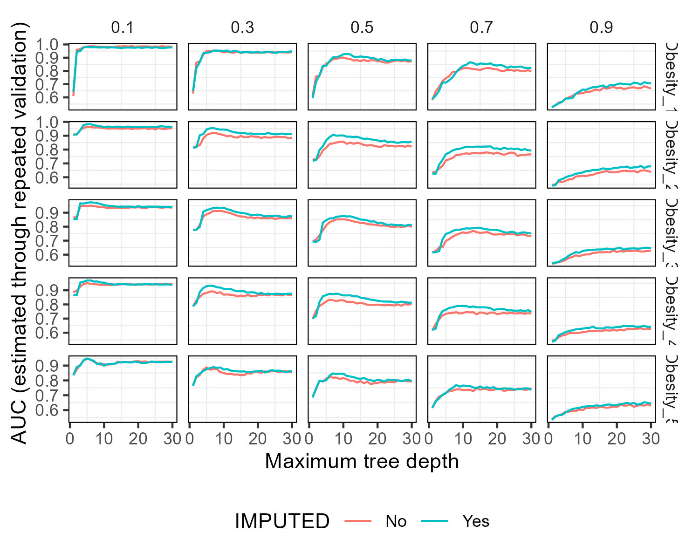

# Ejercicio 3

```{r setup, include=FALSE}
knitr::opts_chunk$set(echo = TRUE)
source("exp_propio.R")
```

En el ej_1 realizamos una transformación para modificar ciertas categorias de la columna "NObeyesdad" (Insufficient Weight, Normal Weight, Overweight Level I, Overweight Level II) por 0 indicando que el individuo no tiene obesidad y (Obesity Type I, Obesity Type II y Obesity Type III) por 1 indicando que el individuo tiene obesidad.
Ahora queremos explorar cómo la optimización del punto de corte utilizado para clasificar individuos como "obesos" o "no obesos" puede influir en el rendimiento del modelo. Nuestra hipótesis es que al ajustar este corte, si la cantidad de ceros y unos llegan a un numero parecido, podríamos mejorar la capacidad del modelo para predecir mejor. Sin embargo, también consideramos que cambios en el corte podrían aumentar los errores de clasificación. Nuestro objetivo es examinar cómo estos ajustes afectan las métricas de evaluación del modelo.

Luego de realizar las transformaciones probando distintos cortes de clasificación, vemos la frecuencia de ceros y unos en cada una. 

Clasificamos desde data_1, siendo el corte mas restrictivo (solo Obesity Type III considerado como obesidad), hasta data_5, siendo el corte mas abarcativo (considerando a Overweight Level I, Overweight Level II, Obesity Type I, Obesity Type II y Obesity Type III como obesidad).

```{r echo=FALSE}
data_1 <- read.csv("./data/transformacion_1.csv")
data_2 <- read.csv("./data/transformacion_2.csv")
data_3 <- read.csv("./data/transformacion_3.csv")
data_4 <- read.csv("./data/transformacion_4.csv")
data_5 <- read.csv("./data/transformacion_5.csv")

columna_categorias <- "NObeyesdad"

calcular_tabla_frecuencias <- function(data) {
  tabla_frecuencias <- table(data[, columna_categorias])
  print(tabla_frecuencias)
}

cat("Frecuencias para data_1:\n")
calcular_tabla_frecuencias(data_1)

cat("\nFrecuencias para data_2:\n")
calcular_tabla_frecuencias(data_2)

cat("\nFrecuencias para data_3:\n")
calcular_tabla_frecuencias(data_3)

cat("\nFrecuencias para data_4:\n")
calcular_tabla_frecuencias(data_4)

cat("\nFrecuencias para data_5:\n")
calcular_tabla_frecuencias(data_5)
```


```{r echo=FALSE}
source("./provided_functions_exp_propio.R")

```


Luego de realizar los experimentos, observamos un patrón interesante: el modelo obtuvo su mejor rendimiento cuando el punto de corte fue más restrictivo, clasificando a un grupo más pequeño como "obeso". En este contexto, notamos que esta mejora podría relacionarse con la presencia de patrones extremos en los estilos de vida de los individuos clasificados como obesos. Esta agrupación de casos extremos podría ser más coherente con la forma en que el modelo está aprendiendo y generalizando, lo que a su vez mejora su capacidad predictiva para estos casos específicos. 


