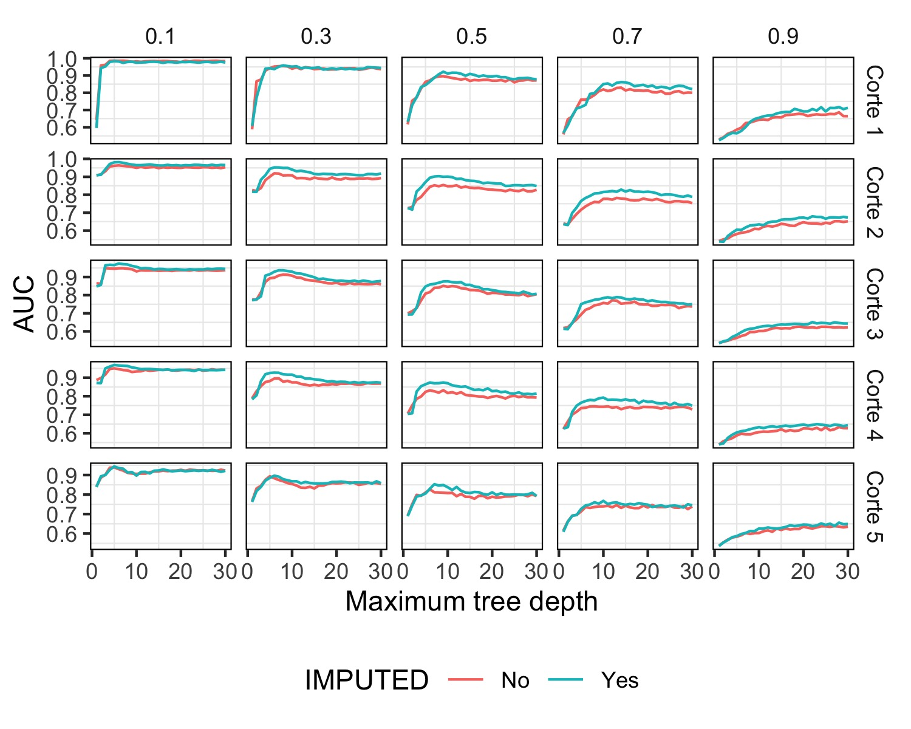

# Ejercicio 3

```{r setup, include=FALSE}
knitr::opts_chunk$set(echo = TRUE)
source("exp_propio.R")
```

En el experimento 1 realizamos una transformación para modificar ciertas categorias de la columna "NObeyesdad" (Insufficient Weight, Normal Weight, Overweight Level I, Overweight Level II) por 0 indicando que el individuo no tiene obesidad y (Obesity Type I, Obesity Type II y Obesity Type III) por 1 indicando que el individuo tiene obesidad. Ahora queremos explorar cómo la optimización del punto de corte utilizado para clasificar individuos como "obesos" o "no obesos" puede influir en el rendimiento del modelo. Nuestra hipótesis es que al ajustar este corte, si la cantidad de ceros y unos llegan a un numero parecido, podríamos mejorar la capacidad del modelo para predecir mejor. Sin embargo, también consideramos que cambios en el corte podrían aumentar los errores de clasificación. Nuestro objetivo es examinar cómo estos ajustes afectan las métricas de evaluación del modelo.

Luego de realizar las transformaciones probando distintos cortes de clasificación, vemos la frecuencia de ceros y unos en cada una.

Clasificamos desde corte 1, siendo el corte mas restrictivo (solo Obesity Type III considerado como obesidad), hasta corte 5, siendo el corte mas abarcativo (considerando a Overweight Level I, Overweight Level II, Obesity Type I, Obesity Type II y Obesity Type III como obesidad).

La tabla que viene a continuacion es la proporcion de casos de obesidad positivos segun el corte utilizado. A su vez, En el siguiente gráfico, examinamos cómo varía el valor máximo del AUC en diferentes conjuntos de datos en función de los umbrales de corte utilizados para asi tener una intucion de que esperar. También buscamos visualizar cómo estos umbrales de corte afectan a conjuntos de datos con distintos niveles de valores faltantes. En el caso del Corte 1, solo se consideran como "obesos" (1s) a los individuos con obesidad extrema, mientras que al resto se les clasifica como "no obesos" (0s). Por otro lado, en el otro extremo de Corte 5, incluso los individuos con un nivel 1 de sobrepeso son considerados como "obesos".

```{r echo=FALSE}
data_1 <- read.csv("./data/transformacion_1.csv")
data_2 <- read.csv("./data/transformacion_2.csv")
data_3 <- read.csv("./data/transformacion_3.csv")
data_4 <- read.csv("./data/transformacion_4.csv")
data_5 <- read.csv("./data/transformacion_5.csv")

columna_categorias <- "NObeyesdad"

calcular_tabla_frecuencias <- function(data) {
  tabla_frecuencias <- table(data[, columna_categorias])
  print(tabla_frecuencias)
}

cat("Frecuencias para corte 1:\n")
calcular_tabla_frecuencias(data_1)

cat("\nFrecuencias para corte 2:\n")
calcular_tabla_frecuencias(data_2)

cat("\nFrecuencias para corte 3:\n")
calcular_tabla_frecuencias(data_3)

cat("\nFrecuencias para corte 4:\n")
calcular_tabla_frecuencias(data_4)

cat("\nFrecuencias para corte 5:\n")
calcular_tabla_frecuencias(data_5)
```

```{r echo=FALSE}
source("./provided_functions_exp_propio.R")

```

Luego de realizar los experimentos, observamos un patrón interesante: el modelo obtuvo su mejor rendimiento cuando el punto de corte fue más restrictivo, clasificando a un grupo más pequeño como "obeso". En este contexto, notamos que esta mejora podría relacionarse con la presencia de patrones extremos en los estilos de vida de los individuos clasificados como obesos. Esta agrupación de casos extremos podría ser más coherente con la forma en que el modelo está aprendiendo y generalizando, lo que a su vez mejora su capacidad predictiva para estos casos específicos.\
Cabe a destacar que no hay gran diferencias entre que sea imputados los datos faltantes o no a lo que vimos enel experimento 1, cumple con los mismos patrones y tendencias, mostrandose siempre superior los casos en los que estan imputados.

```{r echo=FALSE}
# Cargar la biblioteca
library(ggplot2)

# Leer los datos desde el archivo
data <- read.table("./outputs/tables/exp_propio.txt", header = TRUE)

# Filtrar los datos para obtener el máximo AUC para cada transformación y prop_NAs
max_auc_data <- aggregate(auc ~ dataset_name + prop_NAs, data, max)

# Filtrar los datos para obtener el máximo AUC para prop_NAs de 0.1 a 0.9
max_auc_range <- subset(max_auc_data, prop_NAs >= 0.0 & prop_NAs <= 0.9)

# Crear el gráfico utilizando ggplot2
auc_plot <- ggplot(max_auc_range, aes(x = dataset_name, y = auc, color = factor(prop_NAs))) +
  geom_point(shape = 16, size = 3) +
  geom_line(aes(group = prop_NAs), linetype = "dashed") +  # Line connecting points
  labs(title = "Máximo AUC por Dataset con distinto criterio de corte",
       x = "Dataset",
       y = "Máximo AUC",
       color = "prop_NAs") +
  theme_minimal() +
  theme(axis.text.x = element_text(angle = 45, hjust = 1))

# Mostrar el gráfico
print(auc_plot)
```

En conclusión, nuestra exploración en este gráfico nos ha proporcionado una perspectiva valiosa sobre cómo los umbrales de corte influyen en el rendimiento del modelo en diferentes conjuntos de datos. Hemos demostrado que el conjunto de datos con el umbral de corte más extremo, en particular en el caso de obesidad (Dataset Corte 1), logra el máximo rendimiento en términos de predicción, sin importar la proporción de valores faltantes que pueda tener. Este hallazgo respalda la idea del "entrenamiento con valores extremos", donde las instancias más notables y marcadas desempeñan un papel esencial en mejorar la capacidad de predicción del modelo.

Nuestra observación de estos resultados nos ha llevado a comprender que nuestras decisiones previas respecto a los umbrales de corte podrían no haber maximizado el potencial de prediction. Al identificar el corte óptimo que resalta las características extremas, hemos avanzado en la mejora de nuestras estrategias de modelado y nos ha brindado un enfoque más informado y efectivo para abordar casos similares en el futuro para casos similares a este.
